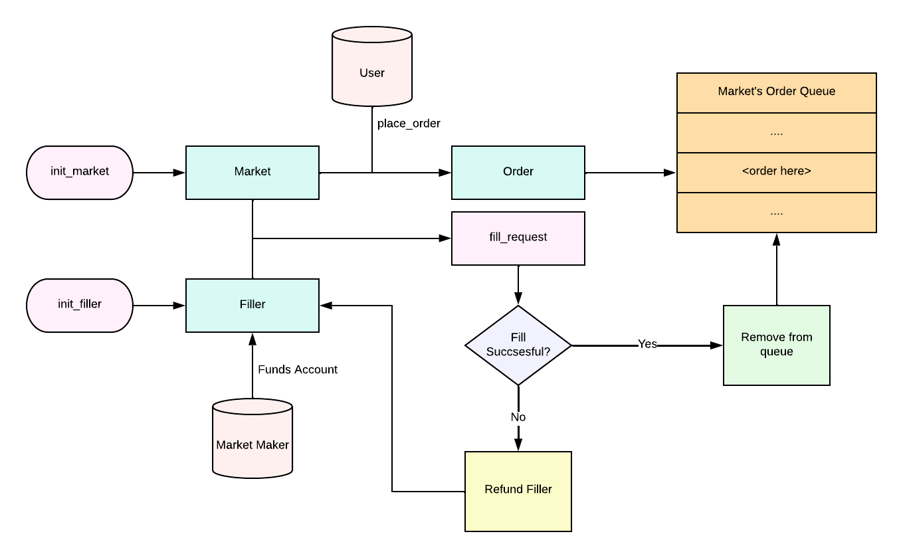

# Seagull JIT Spot Market (OUTDATED!)
A JIT(Just in Time) auction mechanism can assist in tightening spreads on orders by allowing for Market Makers
to properly hedge the other leg of the order on a more efficient, better priced, often CEX market. This should result 
in tighter spreads to be achieved as the counterpart does not need to maintain a hedge constantly like on a 
CLOB(Central Limit Order Book).

## Design Outline
High Level overview without auction phase complexities.



The following sections will reference the following placeholder values for explanation.
 - `t` Current Time

#### Auction Phases
 - `Auction Ongoing` Auction Mechanism (detailed below)
 - `Backstop Ongoing` Backstop Mechanism (detailed below)
 - `Completed` Auction has been completed either by expiry of all phases or a successful fill.

### Auction Mechanism
#### Place Auction Order
The user can place an [order](state.md#Order) on a [market](state.md#Market).

This order is then placed in a CritBit order queue. Note that we might want to try and sort the collection by duration left, maybe 
instead of a fixed time we use the slot when the auction ends, which would require changing the above structure of the order as well.

#### Auction Fill Request
This action is done on a specific [order](state.md#Order) placed above. Auction Fill Requests cannot be cancelled until a better request
overtakes it by providing a better price. 

A [Filler](state.md#Filler) needs to be created by the auction filler which will hold the funds and lock all outstanding fill requests funds inside.
This way we are not moving assets back and forth between accounts and the auctions should be less computationally intensive on the network.

This [fill request](state.md#Fill Request) will be assigned to the orders `fill_request` if it is better than the existing request. Orders can only be appended when
time is less than the auction end.

#### Order Crank and Fill
A keeper instruction needs to be in place to advance the order, this is a permission-less instruction and will do the following in 
specific scenarios.

Optional [Filler](state.md#Filler) is defined as `filler` with enough funds to fill the order in case of backstop phase entry.
[Order](state.md#Order) is defined as `order`. 
Execute top down.

```
// Auction Filled Already
IF `order.completed` exit with error `Order has already been completed!`

// Auction Execute Fill
IF `t >= order.a_end && order.fill_request.filler != null` Fill the order and swap assets, set `order.completed` to true.

// Backstop Phase Fill
ELSE IF `filler != null && t >= order.a_end && order.fill_request.filler == null && t < order.b_end` Attempt to fill the order with the filler 
accounts funds. If filled, set `order.completed` to true.

// Order Expiry
ELSE IF `!filled && t >= order.a_end && t >= order.b_end` Set `order.completed` to true.

IF `order.completed` Remove order from the CritBit queue

ELSE OK.
```

### Backstop Mechanism
As you may have seen mentioned above the backstop phase happens after an auction phase has ended with no filler. This
opens the order up to be filled by an atomic transaction which could be a swap via an aggregator such as Jupiter or 
Prism. This allows orders to always be filled as we can fill these via the client who placed the order as well. This 
does however mean that slippage is really important as someone can come in and give the lowest possible fill price 
depicted by the order and it will go through!